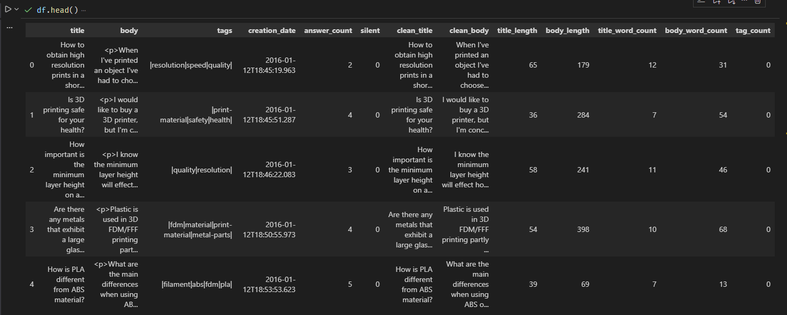
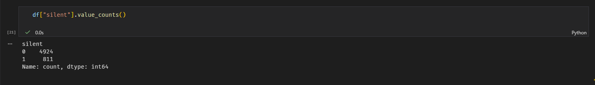
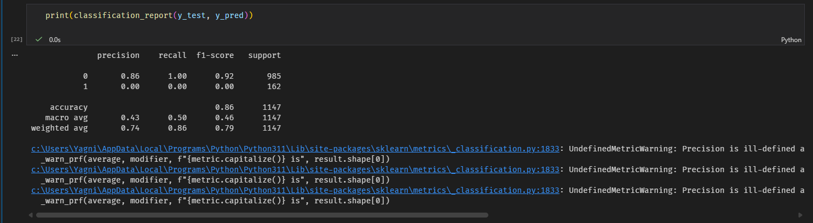
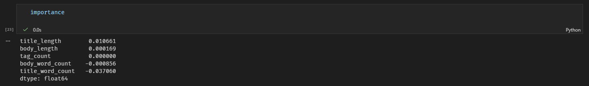

# Unanswered but Asked

Modeling why some questions receive no responses using data and machine learning.

## Problem
Many questions are asked online but never receive answers. This project studies patterns behind unanswered questions.

## Approach
- Use a public Q&A dataset
- Label questions as answered or unanswered
- Train a machine learning model to identify factors that lead to silence

## Key Insights

1. Questions with more detailed descriptions are significantly less likely to remain unanswered.
2. Proper tagging strongly reduces the probability of silence.
3. Very short or vague titles correlate with higher chances of receiving no response.
